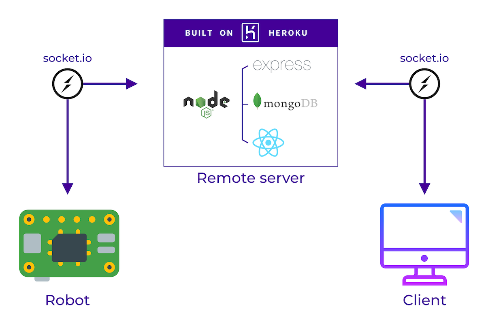

# Noduino

## The project
Noduino is the final project of [David Casas](https://www.linkedin.com/in/david-casas-arenas/) and [Rubén Villar](https://www.linkedin.com/in/rubenvillargrela/) for Ironhack's Web Development Bootcamp. Our objective in the project is to demonstrate how nowadays web technologies can be used to create not only webpages but almost anything you can imagine 🚀.

With this in mind, we have created Noduino (*Node* + *Arduino*), a robot that can be controlled online with a metal detector which is able of detect landmines and to save the information in a database.

**Obviously**, Noduino is just a proof of concept and it is not intended for a practical application. [Demining](https://en.wikipedia.org/wiki/Demining) is a very complex (and costly) subject that involves both technology and human craftsmanship.

## The robot
  
The robot is built with the following components:
- An Arduino board, responsible for controlling the camera's servos, the metal detector, and the motion.
- A Raspberry Pi, to which the Arduino board is connected. It has a Node Js server running that communicates the robot with a remote server via WebSockets.
- A small touch screen that allows us to see the local IP and to shut down the Raspberry.
- A Raspberry Pi Camera module. In addition to Node Js, the Raspberry runs a script written in Python that streams the camera's signal.
  
## Connection diagram
  
- The Raspberry Pi connects via WebSockets to a remote server which contains both the backend and the frontend, and the database. Once the connection is made: 
  - It listens to commands to move the servos and the wheels.
  - It sends a message if a metal object is detected.
- The remote server performs the opposite functions, listening for detections and sending commands.
- The user connects to the server via a webpage, where he can drive the robot and record the path in the database.

## Technologies used

### Backend
- **Node Js**: run-time environment.
- **Express**: web framework.
- **socket.io** for the communication between servers (Raspberry and remote server).
- **mongoDB**: database manager.
- **mongoose**: ODM.
- **Passport**: authentication middleware.

### Frontend
- **React**: front-end library.
- **Axios**: auth and DB communication with the backend.
- **socket.io**: send commands to the robot and receive status/events from it. 

## The Raspberry
The Raspberry Pi is Noduino's *brain*. It has the following services running, which are managed with [PM2](http://pm2.keymetrics.io/):
1. [Rasp-Client](https://github.com/noduinhack/ironhack-rasp-client): a Node.js server performing the following tasks:
   - Show in the touchscreen the Raspberry's local IP and a button that allows us to shut it down.
   - Connects via WebSockets with the remote backend and send/receive status and commands.
   - Controls the Arduino by using [Johny-Five](http://johnny-five.io/)
2. [Raspberry-video-stream](https://github.com/noduinhack/raspberry-video-stream): a simple script written in Python which streams video from the Raspberry Pi cam module to the local network.

## Noduino in action

Click on the image to watch a small video of Noduino in action.

